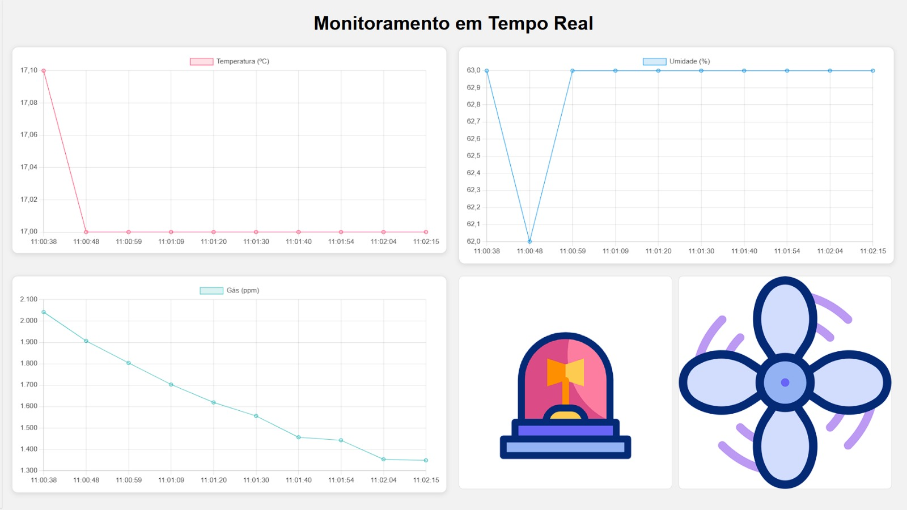

# 🍳 Cozinha Inteligente com ESP32 e Flask

Este projeto tem como objetivo criar um sistema inteligente para monitoramento de ambientes de cozinha, utilizando o microcontrolador **ESP32** em conjunto com um site desenvolvido em **Flask (Python)**. Os dados dos sensores são enviados por **API REST** para o backend, armazenados via **PostgreSQL** local, e exibidos em tempo real no frontend utilizando **HTML, CSS, JavaScript** e **Chart.js**.

---

## 📌 Funcionalidades

- 📡 **Leitura de sensores**:
  - **DHT11**: mede a temperatura e a umidade do ambiente.
  - **MQ-5**: detecta gases inflamáveis como GLP, butano e gás natural.

- 🌬️ **Controle do cooler de exaustão**:
  - **Acionamento manual** por botão físico conectado ao ESP32.
  - **Acionamento automático** com base nos dados dos sensores (temperatura elevada ou presença de gás).

- 🌐 **Envio de dados por API**:
  - O ESP32 envia os dados dos sensores para o servidor Flask via requisições HTTP POST.

- 📊 **Visualização no site**:
  - Dashboard com gráficos gerados pelo **Chart.js**.
  - Interface web para monitorar a temperatura, umidade e nível de gás em tempo real.

---

## 🧰 Tecnologias Utilizadas

### ⚙️ Hardware

- **ESP32 DevKit**
- **Sensor DHT11** (temperatura e umidade)
- **Sensor MQ-5** (gás inflamável)
- **Cooler 12V**
- **Botão físico**
- **Ponte H Dupla L298N**
- **Fonte externa para o cooler**

### 💻 Software

- **Arduino IDE** (para programar o ESP32)
- **Python + Flask** (backend da aplicação web)
- **PostgreSQL + pgAdmin4** (banco de dados)
- **HTML + CSS + JavaScript** (frontend)
- **Chart.js** (gráficos em tempo real)
- **JSON** (formato de envio de dados do ESP32 para o servidor)

---

### 📸 Print da tela principal



---

## 📂 Estrutura do Projeto

```
cozinha-inteligente/
├── firmware/                  ← Código do ESP32 (cozinha_esp32.ino)
├── backend/                  ← Aplicação Flask
    ├── app.py                ← Servidor e rotas
    ├── requirements.txt      ← Bibliotecas utilizadas (Python)
    ├── database/             ← Banco de dados
    ├── tests/
    ├── templates/
        └── index.html        ← Página principal do site
    ├── static/                   ← CSS, JS e bibliotecas (inclui Chart.js)
        ├── css/
        ├── img/
        └── js/
└── README.md
```

---

## 🔌 Esquema de Ligações

- **DHT11**:
  - VCC → 3.3V
  - GND → GND
  - DATA → GPIO 4

- **MQ-5**:
  - VCC → 5V
  - GND → GND
  - A0 → GPIO 34 (leitura analógica)

- **Botão**:
  - Um terminal no GND
  - Outro no GPIO 5 (com pull-up interno ativado)

- **Cooler**:
  - Controlado via Ponte H Dupla L298N ligado ao GPIO 18

---

## 🚀 Como Executar o Projeto

### 1. ESP32 (Controlador)

- Instale a **Arduino IDE** e configure o suporte ao **ESP32**.
- Carregue o código em `cozinha_esp32/cozinha_esp32.ino`.
- Configure o Wi-Fi e a URL da API no código (biblioteca "secrets.h").

### 2. Servidor Flask (Python)

```bash
cd backend
pip install -r requirements.txt
python app.py
```

- O servidor irá rodar localmente em `http://localhost:5000/`.
- O ESP32 deve enviar POSTs para `http://<IP_DO_SERVIDOR>:5000/api/sensores`.

### 3. Acessar o Dashboard

Abra o navegador em `http://localhost:5000/` para visualizar os dados.

---

## 🧠 Possíveis Melhorias Futuras

- Armazenamento dos dados em banco (SQLite ou Firebase)
- Alertas por e-mail ou Telegram
- Controle via celular com interface mobile
- Interface gráfica com React ou outro framework moderno

---

## 👨‍💻 Autores

- Desenvolvido por **Lucas Oliveira Garcez**  🔗 [GitHub](https://github.com/lucasogarcez)
- Desenvolvido por **Bruno Meireles**  🔗 [GitHub](https://github.com/Magr0g)
- Desenvolvido por **Marcos Lima**  🔗 [GitHub](https://github.com/marcoslima42)
- Desenvolvido por **Rafael Lopes**  🔗 [GitHub](https://github.com/RafaelAuLopes)
---

## 📝 Licença

Este projeto está licenciado sob a [MIT License](LICENSE).
